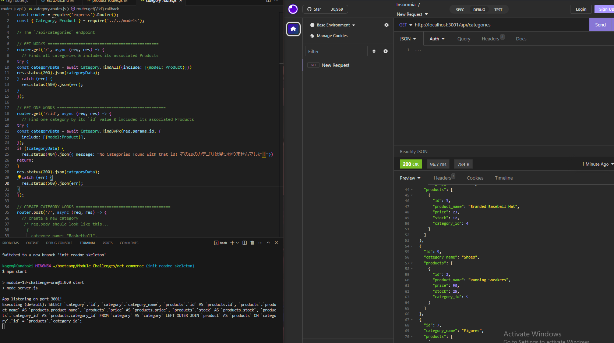

# Net Commerce 

  ## Table of Contents
- [Description](#description)
- [Installation](#installation)
- [Usage](#usage)
- [Credits](#credits)
- [License](#license)
- [Contributing](#contributing)
- [Tests](#tests)
- [Questions](#questions)

## Description 
Motivation for this project was to polish the knowledge of CRUD (Create, Read, Update, Delete) operations through the use of routes to
provide the backend for an Ecommerce website. The project was built through a need to gain a deeper understanding of the capabilities of
Object-Relational Mapping to interact with a MySQL database. By providing a back-end that communicates to the front end, we can store and organize data through our server routes to ensure that our websites have data to send back to the client as well as to handle a client's requests. Concepts learned in **Net Commerce**
include PUT routes which are used to update objects, as well as exploring the other routes such as POST, GET, and DELETE. Sequelize models were also learned to 
configure tables and define the relationships between such models.

## Installation
To install and get the app running, start by creating a .env file following the .env.EXAMPLE, and inputting your MySQL credentials to ensure a connection to Sequelize (Now would be a good time that you have your node modules set up). Now that you have your connection setup, login to your MySQL database using the command **mysql -u root -p** and then source the database using **SOURCE db/schema.sql**. Now that you have the database available you can exit MySQL and seed the database. To do so run **npm run seed** to populate your database. Scroll below to the Usage section to continue. 

## Usage
Usage Image:

With your terminal open, make sure you are in the correct file directory for this project. Then run the line **npm start** to get node to start up the server
and you are ready to make requests to the categories, products, and tags models. In my case Insomnia was used to make such requests. You can use a GET request to get all table data or one item's data for a model. A POST request can be used to create new items for a table. A PUT request can be used to update a table by passing it the id. And lastly you can use a DELETE request similarly to a PUT by passing it the id as well. Refer to the video below for more information.

Link to Demo Video: https://drive.google.com/file/d/1cRV2vwfpm9MG0Yxcno50KHFrbbn8qowR/view?usp=sharing

## Credits
Original Starter code from: https://github.com/coding-boot-camp/fantastic-umbrella

Repo referenced for development: https://github.com/nramirez686/digitalCommerce

Belongs To Many Model Relationships referenced from: https://www.youtube.com/watch?v=HJGWu0cZUe8&t=3074s&ab_channel=WittCode

## License
License: MIT

## Contributing 
Go to the Questions section for more info.

## Tests 
No tests at this time.

## Questions 
If you have questions regarding the app or if you'd like to contribute, you can reach out to my github or email.

GitHub: https://github.com/Kanabaki

Email: kagomekanabaki@gmail.com
